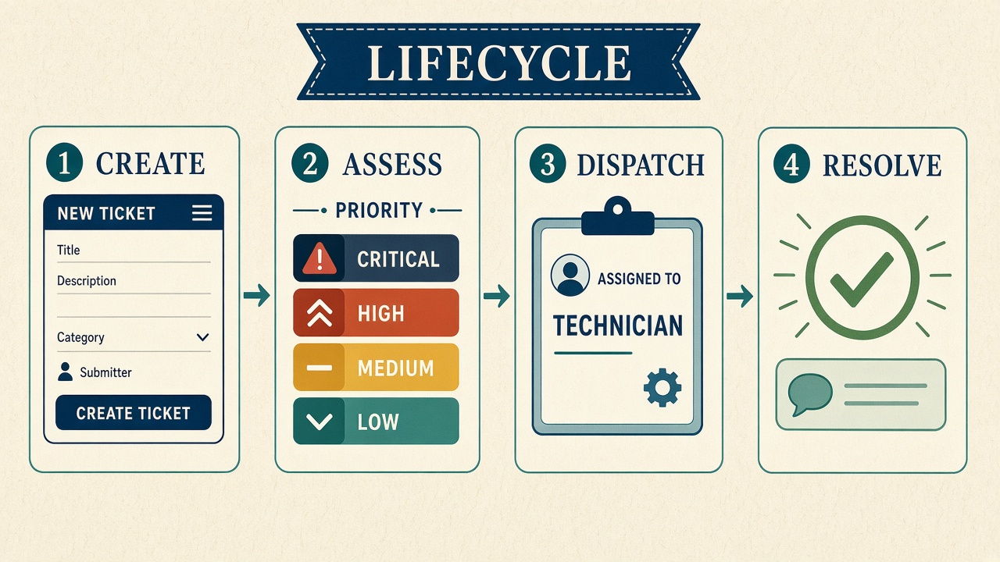
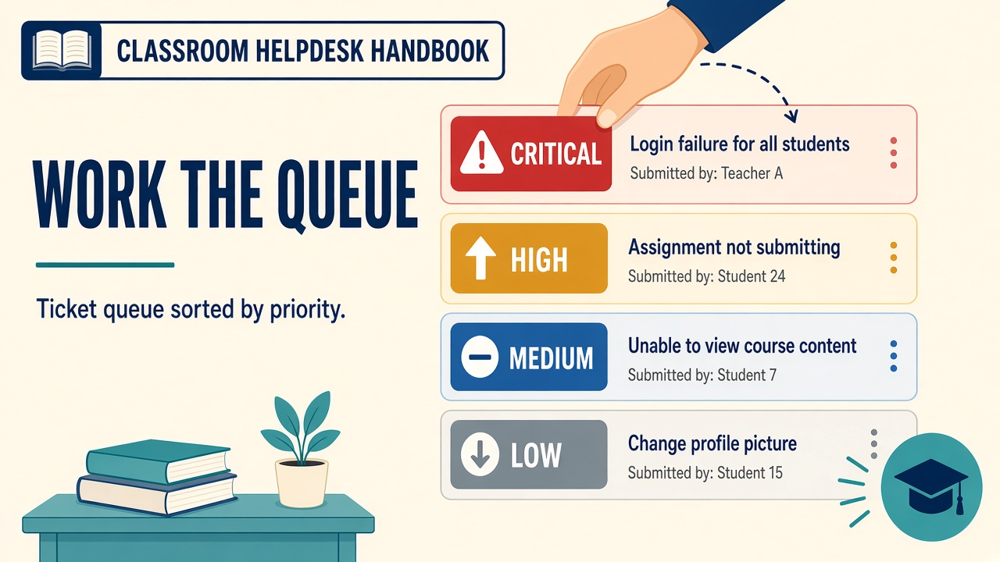

# System documentation





CCST Ticketing is the classroom ticketing system for **Cisco Certified Support Technician IT Support** at ProCloud Training Center, delivered by Mr. Mohsen Salman. Each instructor creates their own class — it is not limited to a single cohort.

It exists so students practise Topic **1.1** (help desk concepts: queues, tickets, SLAs, KPIs, virtualization and cloud) and Topic **1.2** (documentation that summarises a customer interaction) on a live queue instead of on slides only.

## What the system is for

- Log, organise and monitor user requests from creation to closure.
- Force a standard record: **Problem · Actions · Results**, plus root cause, decision log, tags and recommendations.
- Make SLA clocks and KPIs visible so students can see whether the promise to the user was kept.
- Hold a knowledge base and the eight documentation types from Topic 1.2.

It is a **lab**. Simulated requesters (Sales, Finance, HR, and so on) stand in for staff. Student accounts are technicians, not the people on the attendance sheet acting as patients.

## Major features

| Area | Behaviour |
| --- | --- |
| Authentication | Cookie session after username and password |
| Queue | Priority-first list with search, filters, claim, assign. Every column sorts both ways from the arrows in its heading, and the filters survive opening a ticket or leaving the page until **Reset filters** is pressed. |
| Ticket record | Description, tags, CSAT, first-contact resolution. Students write their own documentation off the ticket. |
| Updates | Public comments (user-visible) and internal notes |
| Escalation | L1 → L2 → L3 (instructor). Write the reason. |
| SLA | Acknowledge and resolve deadlines per priority |
| KPIs | Backlog, response, resolution, CSAT, FCR, SLA compliance |
| Knowledge base | Searchable articles for recurring fixes |
| Lab map | The simulated company network in the browser. Click a device for a command prompt or an IOS console; click port to port to run a cable. A desk PC also opens a **Hardware** service bench: power off, unscrew the panel, inspect parts (no colour spoilers), unplug leads, undo mounting screws, and swap parts in bench order. |
| Portals | Password, CBS, VAS and VPN — where the non-desk work is looked up and escalated |
| Workload generator | Instructors create a class's tickets in one click; the lab-map faults are planted for real |
| Docs library | One PDF per guide under **Documentation** |

## Ticket lifecycle (Topic 1.1)

1. **Creation** — the instructor logs it by hand or generates the class's workload. Each ticket records the channel it arrived on: phone, email, chat, walk-in, portal or monitoring.
2. **Assessment** — technician reads impact and sets or confirms priority and category.
3. **Dispatch** — assigned on create, claimed from the unassigned queue, or routed by the instructor.
4. **Resolution and reporting** — every step stays on the ticket until status is resolved or closed.

Statuses: `new` → `open` → `pending` / `escalated` → `resolved` → `closed`.

## Categories in this lab

Access & Identity, Hardware, Software, Network, Printer, Virtualization, Cloud, Email.

Ticket titles use everyday words (internet not working, printer not working, website not working). The Knowledge base has the numbered steps. The work itself happens on the **Lab map** in the browser — nothing to install.

## Architecture (application)

```
Browser (SPA)  →  Express API  →  one JSON document
     public/         server/       Azure blob, or data/db.json locally
```

- **Frontend:** static HTML, CSS and JavaScript. Hash routing (`#/tickets/...`).
- **Backend:** Node.js and Express. REST under `/api`. Deployed as a single Vercel function.
- **Data:** one JSON document holding users, tickets, portals, cabling and device state. Read at the start of a request, written back only when something actually changed.
- **Network simulation:** `server/domain/lab/net-sim.js` answers `ping`, `tracert` and the IOS commands from the cabling and device configuration — there is no external simulator.
- **Sessions:** in-memory map plus an HTTP-only cookie. A server restart or a new deployment signs everyone out.

Where that JSON document lives matters more than it looks: on a serverless host with nowhere durable to write, saves vanish and the app appears to lose priorities at random. See `02-infrastructure.md`. If writes are not durable, every page shows an orange banner saying so.

## Dependencies

Only `express` and `cookie-parser`. Passwords use Node's built-in `crypto.scryptSync`. Running locally needs no cloud account; the deployed copy uses an Azure blob container for storage and, optionally, Gemini to word generated tickets.

## FAQ — quick fixes for the lab

- **A student forgot their password:** the instructor resets it under **Class & students**. There is no shared class password. See `docs/10-accounts.md`.
- **Queue is empty:** that is the starting state. The instructor generates the class's tickets (`03-process.md`, section C).
- **Signed in but API says 401:** cookie lost after a restart or a new deployment. Sign in again.
- **Cannot find a ticket:** use the queue search (id, title, tag, requester, assignee).
- **A saved change came back wrong:** if an orange "nothing is being saved" banner is showing, the server has no durable storage — fix that first, then re-enter the change.
- **The map does not match a ticket:** **Reset to design** re-cables everything and re-plants the faults for tickets that are still open.
