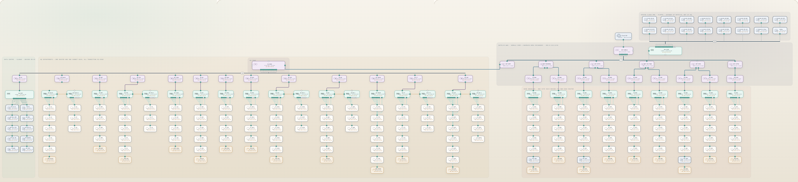

# Infrastructure documentation

This page describes the **virtual and physical** shape of the lab environment: where the app runs, how the parts talk, and where a fault would hide — the same idea Topic 1.1 uses for virtualization and cloud.

## Deployment

The class runs against the deployed app, and the same code runs on a laptop for development.

| | Deployed (what the class uses) | Local (one machine) |
| --- | --- | --- |
| Compute | Azure App Service `ccst-ticketing` (Linux, Node 22, Central India) | One Node.js process on port `3847` |
| Storage | One JSON document in a private Azure blob container (Central India) | `data/db.json` on disk |
| Network | HTTPS at `https://ccst.website` (also `www` / azurewebsites.net) | HTTP on the LAN |
| Identity | Instructor signs up, then adds their own students | Same |
| Database | Azure Database for PostgreSQL (`ccst-ticketing-pg`) | `data/db.json` |

Frontend, API, and database all sit in **Central India** on Azure so reads and writes stay in one region. Redeploy with `npm run deploy:azure` from the project root (Azure CLI required). `08-configuration.md` lists the environment variables.

An alternate **Vercel** deployment (serverless, region `bom1`) is still supported and can use the same Azure blob when `AZURE_BLOB_SAS_URL` is set.

For a local session on the trainer's laptop, students use `http://<trainer-ip>:3847` and the firewall must allow inbound TCP 3847.

## Logical topology

```
[Student browsers]        [Instructor browser]
         \                       /
          v                     v
      +-------------------------------+
      |  Azure App Service            |
      |  (Central India, Node 22)     |
      |  static files + REST API      |
      +-------------------------------+
                     |
                     v
        Azure blob: one db.json
        (private container, Central India)
```

There is one **PostgreSQL** database for durable class state (JSONB documents). Blob storage remains available for backups and rollback. The class — users, tickets, portals, cabling and device configuration — is loaded for a request and written back when something changes. That is worth discussing in class: it is simple and cheap, and concurrent edits of the same ticket in the same instant can still collide.

## The simulated company (Lab map)

The network students work on is drawn in the browser under **Lab map**. It is a simulation inside this app — there is no Packet Tracer file and nothing to install.

247 devices and 239 cables in the shipped design: data centre, twelve HQ departments, Batelco WAN, hosted cloud, and branches A–I.



### Addressing

Every department is its own subnet with its own gateway, and that gateway lives on the department's **distribution router** — not on the HQ edge router. `R1-EDGE` only carries transit links to those routers and the one circuit out to the provider.

| Segment | Subnet | Gateway lives on |
| --- | --- | --- |
| Sales VLAN 10 | `10.10.10.0/24` | `RD-SALES` |
| Marketing VLAN 15 | `10.10.15.0/24` | `RD-MKT` |
| Finance VLAN 20 | `10.10.20.0/24` | `RD-FIN` |
| Legal VLAN 25 | `10.10.25.0/24` | `RD-LEGAL` |
| HR VLAN 30 | `10.10.30.0/24` | `RD-HR` |
| Procurement VLAN 35 | `10.10.35.0/24` | `RD-PROC` |
| Reception VLAN 40 | `10.10.40.0/24` | `RD-REC` |
| Operations VLAN 45 | `10.10.45.0/24` | `RD-OPS` |
| Warehouse VLAN 50 | `10.10.50.0/24` | `RD-WH` |
| Training VLAN 55 | `10.10.55.0/24` | `RD-TRAIN` |
| Data centre VLAN 60 | `10.10.60.0/24` | `RD-DC` |
| Hosted cloud VMs VLAN 70 | `10.10.70.0/24` | `R-AZURE` (via Dubai telecom) |
| IT VLAN 80 | `10.10.80.0/24` | `RD-IT` |
| Support VLAN 85 | `10.10.85.0/24` | `RD-SUP` |
| HQ transit links | `10.10.254.0/24`, in `/30`s | `R1-EDGE` ↔ each `RD-*` |
| Branches A–I | `10.20.10.0/24` · `10.30.10.0/24` · `10.40.10.0/24` · `10.50.10.0/24` · `10.60.10.0/24` · `10.70.10.0/24` · `10.80.10.0/24` · `10.90.10.0/24` · `10.100.10.0/24` | `R2-BRA` … `R10-BRI` |
| Batelco WAN | `203.0.113.0/24` | — |

Desks are numbered from `.10` and printers from `.50` inside their own department subnet. A department with more desks than one switch can carry has a second access switch **trunked** to the first — same subnet, same router, one more switch to check when a whole row of desks goes quiet.

Laptops are `.60` upwards and take their address from **DHCP** rather than having one typed in, which is why a laptop with a `169.254.x.x` address is a different fault from a desk PC with the wrong address typed in.

### DHCP

`CLOUD-VM-DHCP` (`10.10.70.21`) is a real service in the simulation, not a label. A laptop asking for an address has to get through four things, and each one fails differently:

1. its own link has to be up, with a cable that carries data
2. its department router has to be reachable, because that router is the **DHCP relay** for the segment
3. the relay has to reach `10.10.70.21` across the WAN
4. the service on the VM has to be running with addresses left in the scope

If any of those fails the laptop falls back to a link-local `169.254.x.x` address (APIPA) and can talk to nothing. Instructors can stop and start the service from the VM's own console — `dhcp status`, `dhcp stop`, `dhcp start`, `dhcp reset` — which is how the DHCP tickets are planted. The scope hands out option 003 (router) and option 006 (DNS) along with the address, so a scope with the wrong router option gives a laptop that has an address and still cannot leave its own subnet.

On a client, `ipconfig /release`, `ipconfig /renew` and `dhcp on` / `dhcp off` behave the way they do on Windows: `/renew` on an adapter with a typed-in address is an error, not a repair.

### Wi-Fi

Six access points — `AP-REC`, `AP-OPS`, `AP-WH`, `AP-TRAIN`, `AP-BRA`, `AP-BRB` — each hang off `Fa0/23` of their department switch, so a wireless client is on the same VLAN and the same subnet as the desks in that room. The staff network is `ProCloud-Staff` / `Bahrain#2024`; the Training room has its own `ProCloud-Training` / `Train#2024`.

Signal is modelled on distance plus one wall: a laptop can *see* the access point in the next department in `wifi scan` and still be unable to use it. The client commands are `wifi scan`, `wifi join <ssid> <key>`, `wifi on`, `wifi off`, `wifi disconnect` and `wifi status`; on the access point itself the radio is configured in IOS with `dot11 ssid`, `dot11 key`, `dot11 channel`, `dot11 enable` and `dot11 shutdown`, and `show wireless` lists the stations associated to it.

### Cables and connectors

The cable chosen when a link is drawn on the map matters. A PC, printer, laptop or server into a switch or access point takes a **straight-through** copper lead; a PC straight into a router takes a **crossover**; fiber will not go into an RJ45 port at a desk; and a **console** cable is management access only, so a link made with one shows as media disconnected on both ends. Switch and router ports are auto-MDIX, so copper or crossover between two of them both work — which is worth saying out loud in class, because it is the exception, not the rule.

### Devices that appear inside tickets

- PCs — 122 desks, numbered per department: `PC-S1`–`S8` (Sales), `PC-MK1`–`MK4`, `PC-F1`–`F8`, `PC-LG1`–`LG4`, `PC-HR1`–`HR5`, `PC-PR1`–`PR4`, `PC-REC1`–`REC4`, `PC-OPS1`–`OPS8`, `PC-WH1`–`WH8`, `PC-TR1`–`TR6`, `PC-IT1`–`IT8`, `PC-SUP1`–`SUP10`, and `PC-BA*`–`PC-BI*` (five each) at the branches
- Printers — one per department (`PRN-SALES`, `PRN-MKT`, `PRN-FIN`, `PRN-LEGAL`, `PRN-HR`, `PRN-PROC`, `PRN-REC`, `PRN-OPS`, `PRN-WH`, `PRN-TRAIN`, `PRN-IT`, `PRN-SUP`) and one per branch (`PRN-BRA`–`PRN-BRI`), all on `.50`. Each one has a working front panel: `status`, `clear`, `paper`, `toner`, `cancel`, `online`, `offline`, `restart`, and a queue that drains once the blockage is gone
- Laptops — `LT-REC1`, `LT-REC2`, `LT-OPS1`, `LT-WH1`, `LT-TRAIN1`, `LT-BRA1`, `LT-BRB1`, on DHCP and on the wireless network
- Access points — `AP-REC`, `AP-OPS`, `AP-WH`, `AP-TRAIN`, `AP-BRA`, `AP-BRB`, each cabled to `Fa0/23` of its department switch
- On-prem VMs — `VM-DC-01` `.2` · `VM-FS` `.3` · `VM-SQL-CRM` `.10` · `VM-SQL-FIN` `.11` (billing) · `VM-SQL-HR` `.12` · `VM-WEB` `.20` · `VM-MAIL` `.22` · `VM-APP-01` `.30` · `VM-BACKUP` `.31` · `VM-TEST` `.32`
- Hosted cloud VMs — `CLOUD-VM-AD` `.2` · `CLOUD-VM-FILE` `.3` · `CLOUD-VM-SQL` `.10` · `CLOUD-VM-DNS` `.11` · `CLOUD-VM-WEB` `.20` · `CLOUD-VM-DHCP` `.21` · `CLOUD-VM-MAIL` `.22` · `CLOUD-VM-VDI1`–`VDI3` `.30`–`.32` · `CLOUD-VM-APP` `.40` (VAS) · `CLOUD-VM-BAK` `.41` · `CLOUD-VM-MON` `.42` · `CLOUD-VM-LOG` `.43`
- Branch servers — `SRV-BRA`, `SRV-BRC`, `SRV-BRG` on `.20` of their own branch subnet
- Shop sites — `Keratin-Glow` `10.10.70.25` (`keratinglow.bh`) · `Safqa` `10.10.70.26` (`safqa.bh`)
- Switches — one or two per HQ department (`SW-SALES` and `SW-SALES-2`, `SW-MKT`, `SW-FIN` and `SW-FIN-2`, …), one per branch (`SW-BRA`–`SW-BRI`), plus `SW-VIRT` and `SW-CLOUD`
- Routers — `RD-*` (one per HQ department, plus `RD-DC`), `R1-EDGE` (HQ edge), `R2-BRA`–`R10-BRI` (branches), and the provider's `BAT-*`

### The Batelco WAN

```
Data centre     HQ departments (twelve)              Branches A ... I
  SW-VIRT     SW-SALES  SW-MKT  ...  SW-SUP           SW-BRA ...
     |            |        |           |                 |
   RD-DC      RD-SALES  RD-MKT  ...  RD-SUP            R2-BRA ...
     \____________|________|___________|                  |
                        R1-EDGE                    BAT-MUHARRAQ / RIFFA /
                           |                       ISA-TOWN / HIDD / SITRA
                        BAT-SEEF                          /
                            \                            /
                             ------ BAT-HAMALA (core) --------------
                                /          |                      \
                         Cloud-ISP    BAT-DUBAI (Dubai telecom)   (exchanges)
                       (internet)          |
                                        R-AZURE (Azure cloud router)
                                           |
                                        SW-CLOUD (Azure cloud switch)
                                       CLOUD-VM-*
```

Inside HQ there are now two tiers. A desk's gateway is its own department router; that router sends everything else to `R1-EDGE`, which knows one route per department.

A branch does not plug into HQ. It reaches its **area exchange**, then the **Hamala core**, then HQ's exchange, then the edge, then the department router — six routed hops, which is exactly what `tracert` shows a student:

```
1  10.10.10.1      RD-SALES, the desk's own gateway
2  10.10.254.5     R1-EDGE, across the transit link
3  203.0.113.33    BAT-SEEF, HQ's area exchange
4  203.0.113.1     BAT-HAMALA, the core
5  203.0.113.22    BAT-SITRA, the far exchange
6  203.0.113.70    R10-BRI, the branch router
7  10.100.10.10    the desk itself
```

The Azure cloud hangs off Dubai, not off `R1-EDGE` or Hamala directly: **Batelco Hamala → Dubai telecom → Azure cloud router → Azure cloud switch → Azure cloud VM**. That is the lab's cloud-versus-on-prem lesson: `VM-*` is equipment the company owns, `CLOUD-VM-*` is rented and the provider owns the gateway on `R-AZURE`.

### Public addresses and NAT

| Who | Public address | How |
| --- | --- | --- |
| Everything at HQ | `203.0.113.34` | PAT on `R1-EDGE` — the whole site shares one address |
| Each branch | its own router's outside address | PAT on that branch router |
| Each Azure cloud VM | its own `203.0.113.16x`–`17x` | Static 1:1 on `R-AZURE` |

Every device label on the map shows this: the private address on one line, the public one below it. `show ip nat translations` on a router proves it after a `ping`.

## Inventory (lab assets)

| Asset | Name / location | Owner |
| --- | --- | --- |
| Application | `server/index.js` (+ `server/routes/`) | Class / trainer |
| UI | `public/` | Class / trainer |
| Network simulation | `server/domain/lab/net-sim.js`, `server/domain/lab/lab-map.js` | Trainer |
| Deployed state | one blob in the Azure container | Created at first request |
| Local state | `data/db.json` | Created at first start |
| Seed source | `server/data/seed-data.js` | Trainer |
| Documentation | One PDF per guide in **Documentation** | Trainer + students (read) |

## Disaster recovery (lab)

This is a teaching queue, not a production service. Still practise the habit:

1. To keep a class's work, download the blob (or copy `data/db.json` locally).
2. To restore the shipped cabling and device configuration, use **Reset to design** on the Lab map. To empty a local queue completely, `npm run seed`.
3. The code lives in the project folder; if the laptop dies, copy the folder, `npm install`, `npm start`.

If this app were production: a real database, daily backups, a second region, and a written RTO/RPO. The lab stops at "know that those documents should exist" — with one honest exception, since the class already learned what happens when writes go nowhere durable.
