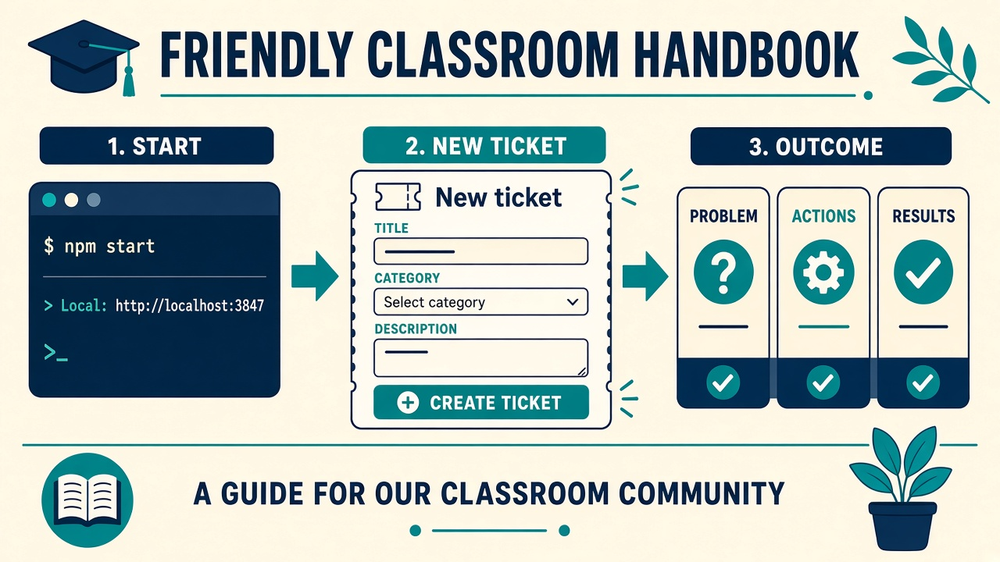
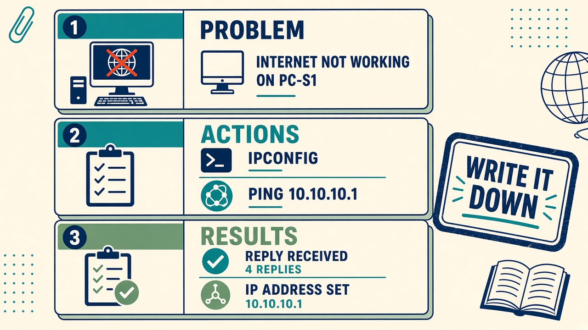
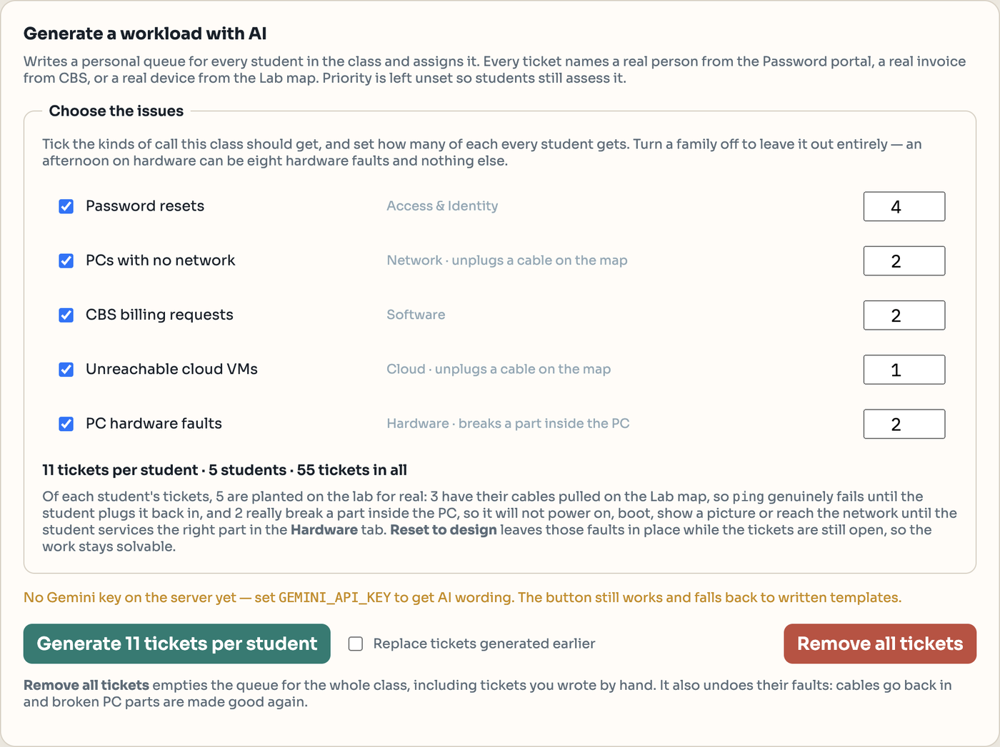

# Process documentation

Step-by-step work for the recurring jobs in this classroom. New technicians should be able to follow these without asking the trainer for the same answers twice.

## A. Start the helpdesk

For a class, open the deployed URL and sign in — there is nothing to start.

To run it on one machine instead:

1. Open a terminal in the project folder.
2. Run `npm install` the first time on that machine.
3. Run `npm start`.
4. Browse to `http://localhost:3847`.
5. Sign in (see `10-accounts.md`).

If port 3847 is busy, set `PORT=3848 npm start`.

## B. Set up a class

1. On the sign-in page, use **Instructor signup** and enter the signup code the trainer gave you. That creates your class and your instructor account.
2. Open **Class & students** and add each student — full name, username, and a starting password.
3. A student who forgets their password comes to you; **Reset password** on that row.

Each class sees only its own tickets, students, portals and Lab map, so two instructors can run side by side.

## C. Give the class a workload

There are no pre-seeded tickets. An empty queue is the starting state.

1. Open **Class & students** and find **Generate a workload with AI**.
2. Under **Choose the issues**, decide what this class is working on. Each kind of call has a tick box and a number: the number is how many of that kind **every student** gets. Untick a kind to leave it out altogether. The line underneath keeps a running total — tickets per student, and tickets in all for the class.
3. The default is eleven tickets each: four password resets, two PCs not connected, two CBS invoice questions, two PC hardware faults, and one unreachable cloud VM. Change it to suit the lesson — an afternoon on hardware can be eight hardware faults and nothing else, and a session on the portals can be password resets and billing only.
4. What you choose is saved for your class, so a mix set up the night before is still there when the class starts.
5. Press **Generate N tickets per student**. Priority is left unset on purpose — assessing it is the exercise.
6. **The lab-map tickets are planted for real.** The network ones unplug the cable on the PCs and the VM they name, so `ping` genuinely fails until a student plugs it back in.
7. **The hardware ones break a part inside the PC.** Depending on the fault, that PC will not power on, will not boot, shows no picture, takes no keystrokes, or has no network link — until the student opens it on the Lab map, checks the **Hardware** tab and repairs the right part.
8. The card tells you how many faults the current mix will plant before you press anything, so you know what state the map will be in.
9. Re-generating for a student replaces their old tickets and undoes their faults: cables go back in and broken parts are made good.

One thing to keep in mind when you turn the numbers up: each lab-map fault takes a device of its own. There are 122 desks on the map, so a class of 25 can have four PC tickets each before the generator starts reusing a desk.

Every generated ticket names a real person from the Password portal, a real invoice from CBS, or a real device from the Lab map, so the student can always find the thing the ticket is about. A hardware ticket describes the symptom only and never the part — working out which part it is is the exercise.

To go back to an empty queue, press **Remove all tickets** on the same card. It deletes every ticket in the class — the generated ones and any you wrote by hand — and undoes their faults, plugging cables back in and repairing broken parts. There is one confirmation and then it is gone: comments, priorities and SLA history go with the tickets, so do it between classes rather than in the middle of one.

To write one by hand instead — you took a call, or you want a specific scenario:

1. Open **Ticket queue** → **New ticket**.
2. Write a specific title in user language. Not "issue". Yes: "Finance: printer not working from PC-F1".
3. Describe who is affected, when it started, and any error text.
4. Set **category**. Leave **priority** empty so the student still has to assess it.
5. Pick the simulated requester and the **channel** you actually used.
6. Assign it, or leave it unassigned for someone to claim.

Students cannot create tickets in this lab — only instructors can.

## C2. Reset between sessions

- **Cabling and device configuration:** **Reset to design** on the Lab map. Cables named by lab-map tickets that are still open stay unplugged so those tickets remain solvable.
- **One student's tickets:** generate again for that student with replace.
- **A local scratch copy:** stop the server, `npm run seed`, start again. This wipes everything and recreates the default instructor.

## D. Work a ticket (Cisco-shaped, compressed into the form)

Topic 1.3 is not the focus of this lab, but the ticket fields still follow the same sequence:

1. Define the problem (Problem box).
2. Gather information (Actions: logs, versions, who else is hit).
3. Identify the cause (Root cause, or an open question if you do not know yet).
4. Plan and implement (keep writing Actions).
5. Observe results (Results + user confirmation).
6. Document and share (Save record, public update, tags, knowledge base link in a comment).

## E. Queue strategy for a Monday morning backlog

From Topic 1.1's real-world scenario:

1. Assess tickets with no priority first, then work critical → high → medium → low.
2. Acknowledge critical tickets first (30 minute response SLA). Once a priority is set, the resolve deadline is filled in automatically.
3. Batch similar low work (password resets) instead of ten context switches.
4. Escalate past L1 early — do not spend three hours proving you are stuck.
5. Leave a public comment on slower tickets so users are not abandoned.

Time blocking for the lab period:

- First 20 minutes: triage and acknowledgements.
- Middle: high and critical.
- Last 20 minutes: documentation quality, not new heroics.

## F. Escalate

1. Open the ticket.
2. Choose **Escalate** and write why it is beyond your expertise.
3. L3 assign goes to the instructor.
4. The reason is stored as an internal comment. That is the skill.

## G. Close a ticket

A ticket is not closed because you are tired of it.

1. Results must say what was verified and that the user confirmed (or why you could not reach them).
2. Root cause filled, or an explicit open question.
3. Tags set so the next person can find it.
4. Status `resolved`, then `closed` after the lab's "stable" check (in production this might be three quiet days).
5. Optional CSAT 1–5 and FCR checkbox — these feed the KPI board.
