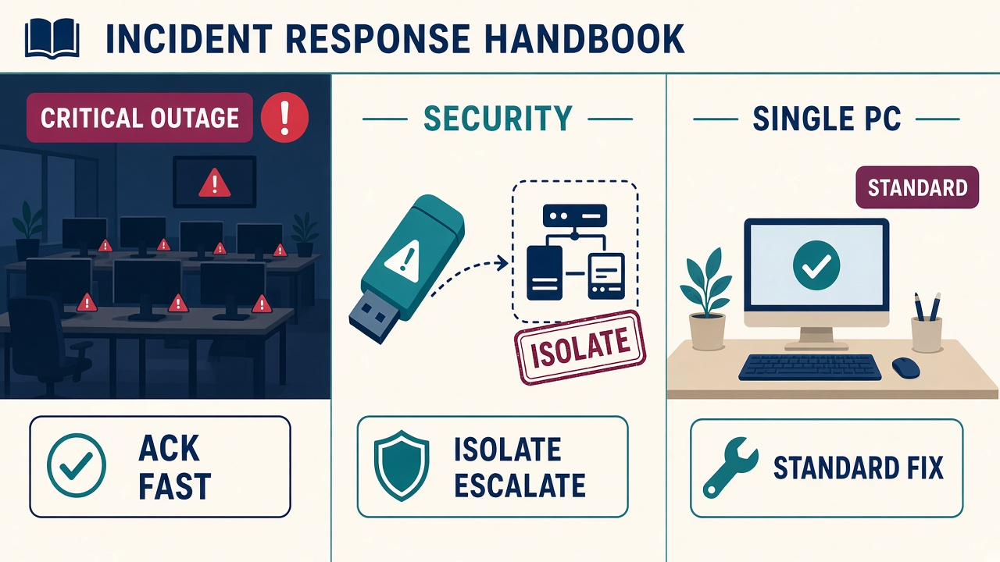

# Incident response

Emergencies need decisions that were made **before** the stress. This is the classroom plan for tickets tagged security, outage, or critical.

## Severity

| Signal | Treat as | First move |
| --- | --- | --- |
| Whole department or revenue system down | Critical outage | Acknowledge in 15 minutes, conference the trainer if needed |
| Failed admin logons, malware suspicion, guest account abuse | Security incident | Isolate, preserve logs, do not debate on the warehouse floor |
| Hybrid mail / cloud sync affecting executives | High | Check connectors and certificates; do not reset random passwords |
| Single PC slow | Medium | Standard troubleshooting — not this playbook |

## Outage actions

1. Confirm **scope**: one user, one VLAN, or the company.
2. Set priority to **critical** if a core service or an entire team is blocked.
3. Post a short **public** update: you have the ticket, you are investigating. Do not promise a false timeline.
4. Work from infrastructure docs (network map, host names). Write old and new configuration if you change anything.
5. When service returns: monitor for a defined window, get user confirmation, then write Results and a recommendation so it does not return.

## Security actions (kiosk / unauthorised access example)

1. **Isolate** the endpoint from the VLAN if you reasonably suspect unauthorised access.
2. Export or screenshot **Security** event logs. Do not paste passwords, CPR numbers, or personal phone numbers into the ticket.
3. Disable risky local accounts (Guest).
4. Escalate to the instructor (standing in for Trust and Safety).
5. Follow up with a post-incident note: what happened, what limited blast radius, what will change (for example "kiosk image will not include Guest").

## Communication templates

**Ack, outage:** "We see Sales cannot reach the customer database. Ticket TKT-xxxx is open. Checking connectivity and last night's firewall change. Next update in 20 minutes."

**Ack, security:** "The warehouse kiosk is isolated while we review the logon alerts. Please use the spare station. Do not try administrator passwords on that PC."

**Close, outage:** "Database access restored after correcting the firewall rule on FW-CORE-01. Sales confirmed quotes open. We will audit that change window."

## Post-incident analysis (always)

- Timeline with timestamps.
- Root cause, not the first symptom.
- What we will do so the next class (or the next Monday) does not repeat it.
- Which knowledge base article to add or update.
