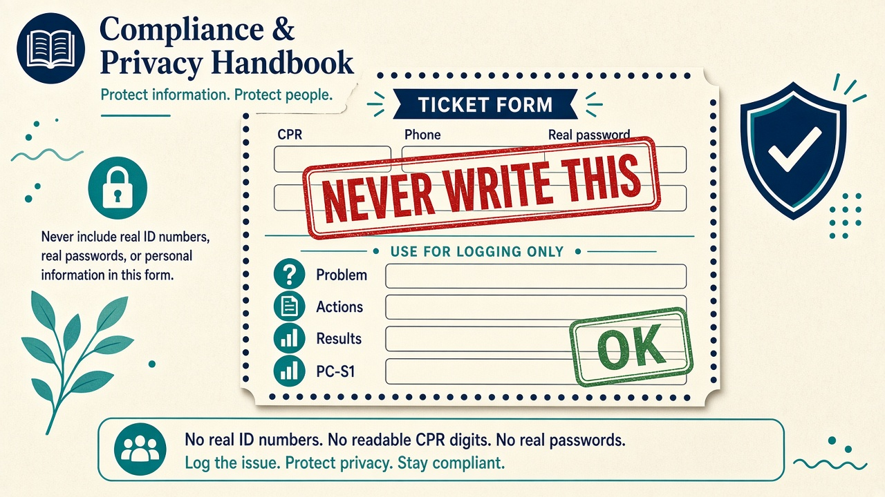

# Compliance and acceptable use

Classroom rules for data, fairness, and how tickets may be written. This is the lab stand-in for organisational policy. It is not legal advice.

## Acceptable use

- Use the system only for CCST classwork.
- Do not try to break into other students' sessions, scrape the JSON store for mischief, or brute-force passwords.
- Treat simulated requesters with the same respect you would give real staff.

## Privacy (PII)

Personally identifiable information includes names paired with national ID numbers, personal phones, passwords, and anything that identifies a private individual outside the lab story.

**This project does not store CPR numbers or telephone numbers from the attendance sheet.** Accounts use display names and classroom usernames only.

On tickets:

- Verify identity through the approved story (HR coordinator, manager) without copying identity documents into the record.
- Never store passwords in the ticket body.
- Anonymise if you discuss a case in front of the class ("the Finance printer", not a real relative's name).

Topic 1.4 in the course goes further on confidentiality and breach reporting. In this lab, suspected security issues are escalated to the instructor.

## Fairness

Do not pick only easy tickets so your personal KPIs look good. The queue is a team object. Priority is based on impact and urgency, not on who asked.

## Passwords for the lab

Shared class passwords are a **lab convenience**. They would be unacceptable in production. If this folder is copied off the training machine, change the passwords in `server/data/seed-data.js` and re-seed.

## Record keeping

Tickets are the official record of what IT did. If it is not written, the class cannot mark it as done. Do not invent CSAT scores; only set them when the scenario says the user was asked.
