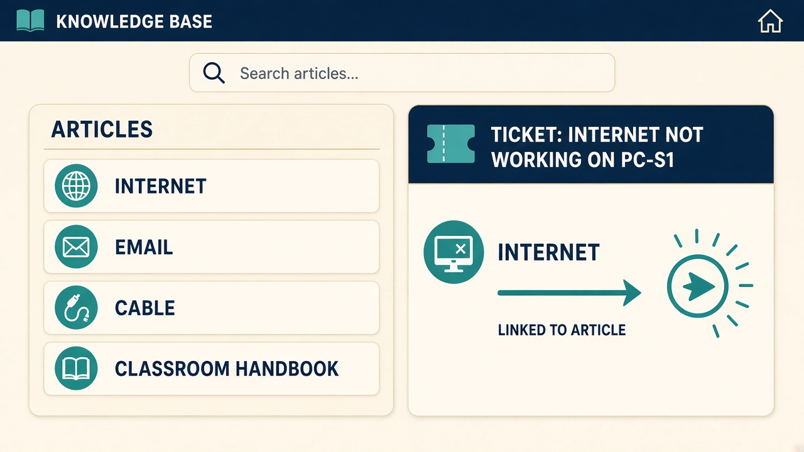

# Knowledge base documentation

The knowledge base is the searchable library of **repeatable fixes**. Topic 1.2 lists it as its own documentation type.

Tickets are written in **user language** (internet not working, printer not working). The articles below are the steps a non-IT reader can follow.

## Where it lives

- In the app: **Knowledge base** in the left navigation.
- In code: `kbArticles` inside `server/data/seed-data.js`.
- One-page class handout: `docs/11-simple-fixes.md`.

## Articles seeded for the class

1. Read this first — every ticket (`ipconfig`, then `ping`, then `tracert` on the named PC).
2. Internet not working.
3. Slow internet.
4. PC not working.
5. Printer not working — ping it first, then read its front panel (includes “the printer light is on but I cannot reach it”).
6. Website not working (`keratinglow.bh`, `safqa.bh`, intranet, CRM).
7. Email not working.
8. Share folder cannot be accessed (“I cannot open the shared folder”).
9. Cloud cannot be reached.
10. Server cannot be reached.
11. How to check your IP.
12. Address cheat sheet.
13. How we choose priority.
14. Problem · Actions · Results.
15. PC is frozen or will not respond (there is no power button — open the **Hardware** tab).
16. How to ping.
17. How to traceroute.
18. The cable fell out (click the device's `Fa0`, then a free port on its own switch).
19. Which cable goes where (straight-through at the desk, crossover PC-to-router, console for management only).
20. Laptop has no address (169.254) — the four steps between the laptop and `CLOUD-VM-DHCP`.
21. Laptop will not join the Wi-Fi — association before addressing.
22. Duplicate address on the network (also covers an invalid mask and a gateway off the subnet).
23. Reset password.
24. When to escalate.
25. VAS, VPN, CBS, and software updates.

Class portals live in the app under **Portals**: Password, CBS, VAS, and VPN. Cloud services are checked on the **Lab map** instead — open the VM and ping it.

## How students should use it

1. Read the ticket title (what the user said).
2. Open the matching article.
3. Follow the numbered steps on the PC named in the ticket.
4. Write **what you actually did** in Problem / Actions / Results.

## Quality bar for a new article

- One sentence summary.
- Numbered steps a new student can click.
- What "done" looks like.
- No CPR, phones, or real passwords.
