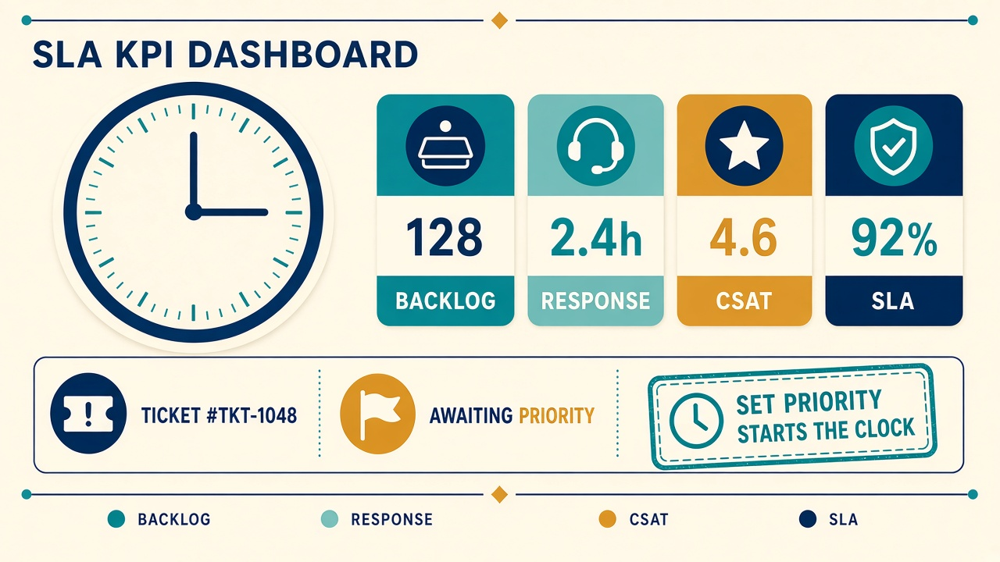

# SLAs, SLOs and KPIs

Topic 1.1: the queue runs against a clock. The SLA is the contract; the SLO is the number inside it; KPIs say whether you kept the promise.

## Service level agreement (classroom)

ProCloud CCST Ticketing promises simulated staff:

- Every ticket is **acknowledged** within the priority window.
- Every ticket is **resolved** within the priority window, or escalated with a written reason before the technician goes silent.
- Priority is assigned from impact, urgency, approaching deadlines, and whether the issue could get worse.

There are no financial penalties in the lab. The "penalty" is a red SLA mark and a worse compliance KPI — the same visibility a real team uses before money enters the conversation.

## Service level objectives

| Priority | Meaning | Response SLO | Resolve SLO |
| --- | --- | --- | --- |
| Critical | Unreachable Cloud VM / cloud service | 30 minutes | 6 hours |
| High | Billing/CBS ticket, or all PCs in a department | 1 hour | 12 hours |
| Medium | One PC issue, one PC with no internet, a shared printer, or a laptop off the wireless | 2 hours | 24 hours |
| Low | Password reset or minor request | 3 hours | 48 hours |

Tickets are created **without** a priority. The SLA deadlines are calculated automatically as soon as a technician sets one. Until then the queue shows “Awaiting priority”.

## Key performance indicators on the dashboard

| KPI | What it measures | How this app calculates it |
| --- | --- | --- |
| Backlog | Unresolved tickets | Status not resolved or closed |
| Average response | Speed of first acknowledgement | Created → first response |
| Average resolution | Speed of fix | Created → resolved |
| CSAT | Satisfaction | Mean of 1–5 scores on tickets that have one |
| SLA compliance | Promise kept | Resolved before resolve-SLO, or still open and not yet breached |

Instructor view uses the **whole queue**. Technician view also shows **mine**.

## Student KPI PDFs

Each student can download a **KPI PDF** from the Dashboard (**Download my KPI PDF**). Instructors can download one PDF per student from **Class & students** (**KPI PDF**), or one combined file for the whole class (**Download all KPI PDFs**). The report uses visual score bars and cards for backlog, SLA, response/resolution times, priority mix, assigned tickets, and an **auto grade** (Pass / Needs work / Incomplete).

Grade weights: **tickets resolved 45** · SLA 20 · overall review mark 20 · correct priority 10 · correct process 5. Leaving assigned tickets open drops the score hard (steep curve, not a flat %).

On each ticket, instructors mark whether the **priority** and **process** were correct (plus a short checklist), which feeds those grade components.

Instructors can also **Export CSV** (roster + KPIs + grade) for marks sheets, set a class **announcement** banner, view **attendance today** (Bahrain day, from sign-in), and open a student **Timeline** of claims, hand-offs, escalations, map resets and portal actions.

## How to read a bad board

If resolution time climbs and SLA compliance drops:

1. Sample tickets for repeated types and slow escalations.
2. Use or write knowledge base articles (templates).
3. Batch password resets.
4. Do not "improve CSAT" by closing tickets that are not fixed.

## Popular products (course names)

Jira, Zendesk, Freshdesk and ServiceNow are the names in the chapter. This lab is a small, local stand-in so you can practise the **ideas** without a vendor account. When you meet those tools at work, look for the same objects: queue, SLA, assignment, and a written record.
