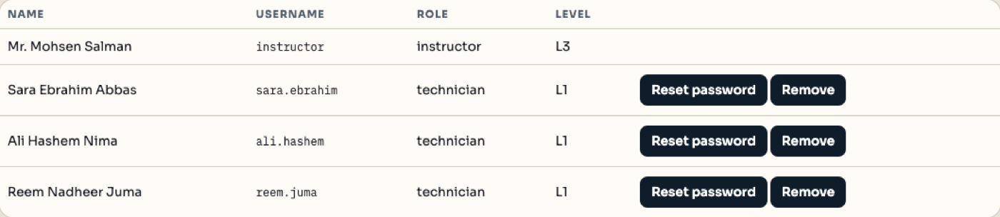

# Classroom accounts

## How accounts are created

There is no shared class password and no built-in roster. Every account is made deliberately:

1. An instructor uses **Instructor signup** on the sign-in page and enters the **signup code** you give them. That creates their class and their own L3 account. Without the code, signup is refused.
2. The instructor opens **Class & students** and adds each student: full name, username, and a starting password.
3. Students sign in with that username and password. They can be removed, and their password can be reset, from the same page.

A class only ever sees its own students, tickets, portals and Lab map, so several instructors can run classes in the same deployment without touching each other's work.

| Role | Level | Can do |
| --- | --- | --- |
| Technician (student) | L1 | Work the queue: claim, set priority, comment, escalate, resolve. Use the Lab map and Portals |
| Instructor | L3 | Everything a student can, plus add and remove students, create tickets, generate a workload, and review resolved tickets |

Creating tickets is instructor-only, so a student account has no **New ticket** button.

## Usernames

Usernames are `firstname.lastname`, lower case, dots for spaces — `sara.ebrahim`, `ali.hashem`. The app normalises whatever you type, so `Sara Ebrahim` becomes `sara.ebrahim`. The current list for a class is always on the **Team** page; that page is the roster, not this document.

## The default local account

A fresh local copy (`npm run seed`) contains exactly one account:

- Username `instructor` · password `ProCloud-G18` · class **CCST IT Support G18**

It has no students and no tickets until you add them. On a deployed copy, the `BOOTSTRAP_INSTRUCTORS` environment variable can create instructor accounts on first run so nobody is locked out (`08-configuration.md`).

## Passwords

- Stored as a salted `scrypt` hash. Nobody, including the instructor, can read a student's password back.
- A forgotten password is **reset**, never recovered: **Class & students** → the student's row → **Reset password**.
- Do not write passwords on tickets.
