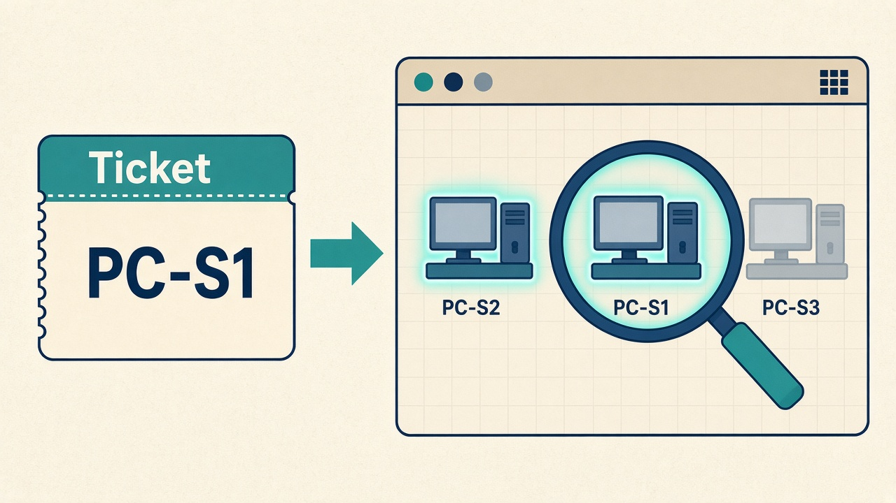
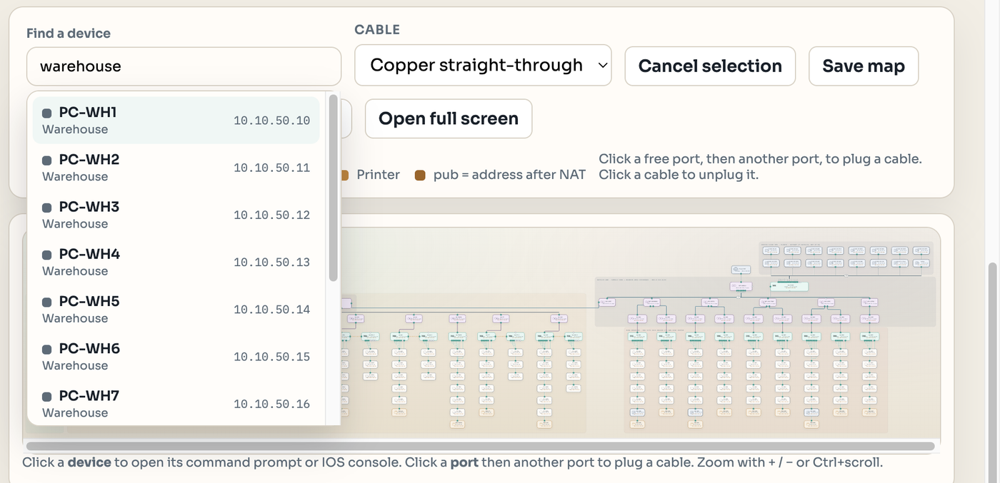
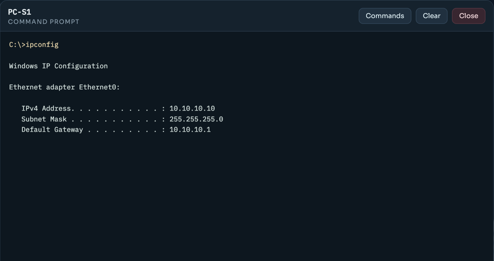
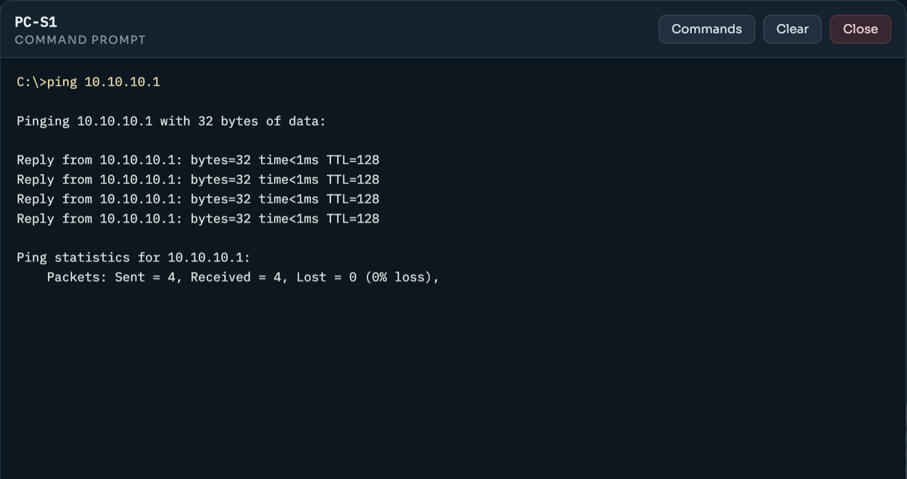
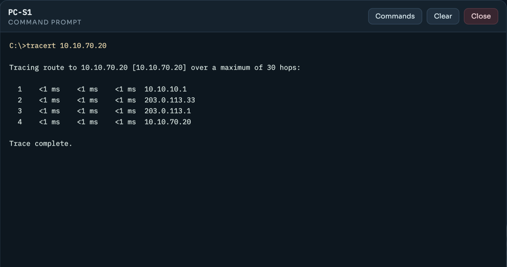
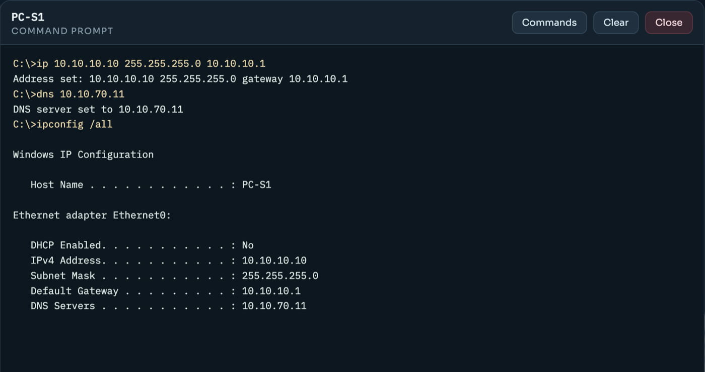
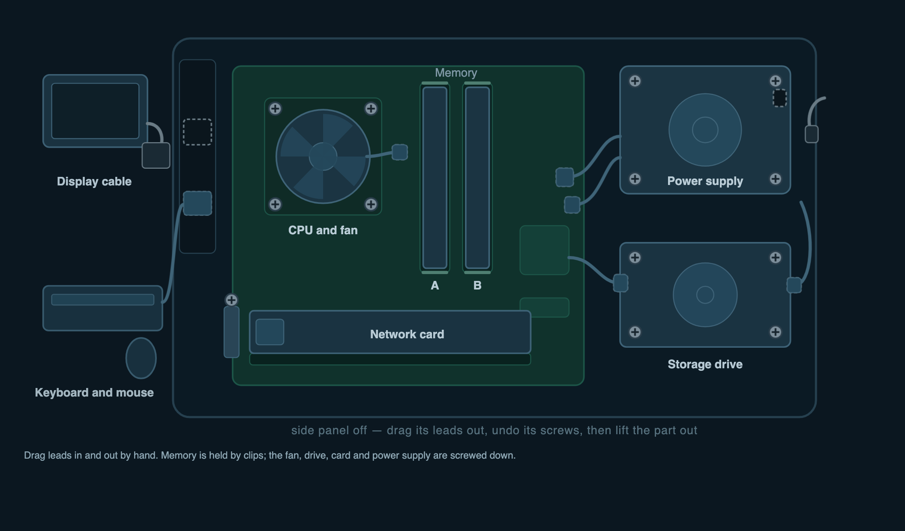
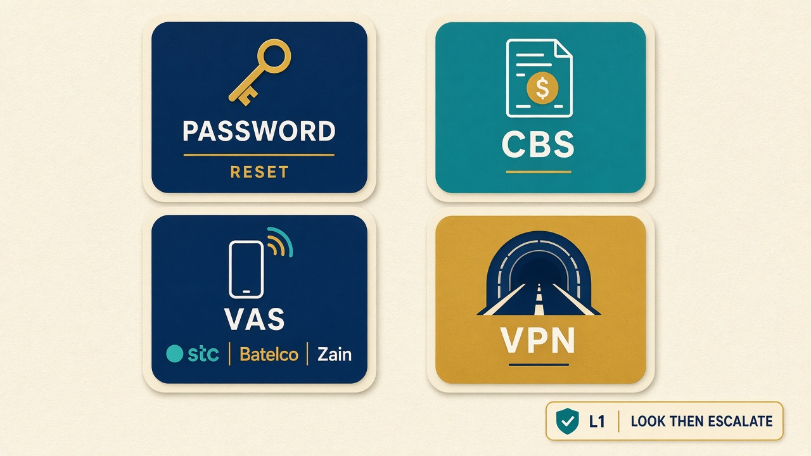
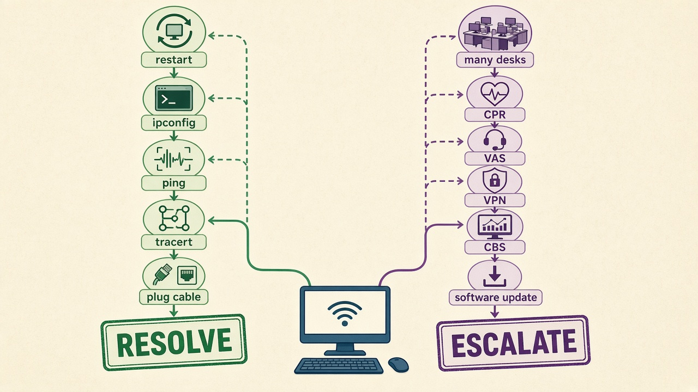

# Simple fixes (read this with the ticket)

Open **Lab map** and click the **device named on the ticket**. Clicking a PC, laptop, printer or VM opens its `C:\>` command prompt; clicking a switch, router or access point opens an IOS console.


You may: run `ipconfig`, `ping`, `tracert` and `nslookup`, set an address, ask for one with `ipconfig /renew`, plug a cable back in, join a laptop to the wireless, clear a printer's front panel, and reset a mailbox password in **Portals**. If that is not enough, **Escalate**.

## Find the device



Do not hunt for it. Type the name from the ticket into **Find a device** at the top left of the Lab map, and the map jumps to it and flashes it. The box also takes an address (`10.10.20.10`), a department (`Finance`), or both together (`sales printer`), so it works even when the ticket only tells you where the caller sits.



The device's column tells you its department, and its label shows its address. Zoom in with `+` or Ctrl+scroll — the cables are easier to read close up.

## Always start here







1. `ipconfig` — is the address on the cheat sheet at the bottom of this page?
2. `ping` the gateway (the `.1` for that department).
3. `tracert` to the far address, and write **hop 1** on the ticket.

If the address is wrong, set it from the prompt:

```
ip 10.10.10.10 255.255.255.0 10.10.10.1     set address, mask and gateway
dns 10.10.70.11                             set the DNS server
```



Type `help` in any command prompt for the full list.

## What your tickets look like

Every student gets the same **shape** of workload, and your instructor chooses how much of each kind is in it. The default is fifteen tickets each:

| How many | Ticket | Where the work is |
| --- | --- | --- |
| 4 | Password reset / cannot sign in | **Portals → Password** |
| 2 | A PC is not connected | **Lab map** — the cable really is unplugged |
| 2 | Something is wrong with the PC itself | **Lab map → Hardware** — a part really is broken |
| 1 | A cloud VM cannot be reached | **Lab map** — that VM's cable is unplugged |
| 2 | A CBS invoice question | **Portals → CBS**, then **Escalate** |
| 1 | A PC has stopped getting an address | **Lab map** — from the desk to the DHCP server |
| 1 | Somebody typed the wrong settings into a PC | **Lab map** — compare with the cheat sheet |
| 1 | Nothing comes out of a shared printer | **Lab map** — the printer's front panel |
| 1 | A laptop will not join the wireless | **Lab map** — the laptop, then its access point |

Your own queue may be weighted differently — a lesson on hardware might be eight hardware tickets and nothing else. The kinds and the way you work each of them do not change.

Priority is deliberately left unset. Assessing it is part of the job, and choosing one starts the SLA clock.

## Match the work

| Ticket is about | What you do |
| --- | --- |
| PC not connected / no network | `ping` the gateway. If it fails, look at the device on the map — a missing cable has no line. Plug it back in |
| A dead PC, a blank screen, beeping, noise, heat, a keyboard doing nothing | Click that PC, open the **Hardware** tab, and read the parts list. Repair the part that is not healthy |
| A cloud VM or website cannot be reached | `ping` the VM from a working PC. If it fails, check that VM's cable on the map |
| Nothing prints | `ping` the department printer (`.50`) first. **If it answers, the network is fine** — click the printer and run `status`, then fix what the panel says. If it does not answer, it is the address or the cable |
| A PC or laptop with a `169.254` address | It asked for an address and got no answer. Work from the desk to the DHCP server — see **Laptop has no address (169.254)** in the Knowledge base |
| A PC that reaches its own floor and nothing else | Somebody typed settings in by hand. Compare `ipconfig` with the cheat sheet below — usually the gateway |
| A laptop that will not get onto the wireless | `wifi status`, then `wifi scan`, then `wifi join`. Association first, address second |
| Password reset / cannot sign in | **Portals → Password**, find the person, **Reset password**. Never write the password on the ticket |
| CBS invoice, VAS, VPN, software update | Look it up in **Portals**, write what you saw, then **Escalate**. L1 has no rights to post billing or open a tunnel |
| Several PCs at once, a CPR number, a virus, a new VLAN, the core down | Write what you checked → **Escalate** |

## The planted faults

### A PC is not connected

The only fault is an unplugged cable. Nothing else about the device is touched.

1. Click the PC named on the ticket and run `ipconfig` — the address is still correct.
2. `ping` the gateway. It fails, and the message tells you the address is in your subnet but nothing answered.
3. Look at the PC on the map. Its cable is gone — no line to the switch.
4. Click the PC's **Fa0** port, then a **free port on its own department switch**. Every access port on that switch carries the right VLAN, so any free one works; the design uses the matching number (`PC-S3` → `Fa0/3`).
5. `ping` the gateway again. Four replies means done. Write that on the ticket.

### Something is wrong with the PC itself

The ticket tells you what the user can see, hear and touch — nothing more. Working out which part it is is the job.

1. Click the PC named on the ticket. If it is dead, there is no command prompt: the window says so instead.
2. Open the **Hardware** tab. The case starts shut, with the monitor, keyboard, mains lead and network port on the back. Open it and you are looking at the motherboard with its CPU and fan, the two memory slots, the network card, the power supply and the drive, with every lead that joins them.
3. Parts are **not** colour-coded. Power off, remove the screws, open the side panel, then **inspect** parts until you find what is wrong.
4. Fix it the way you would at a bench. Leads: select **Hands** and drag a plug out of its socket, or drag it back on until the socket lights up. Memory: open the clips, push the module home, close the clips. A failed part: unplug its leads, undo its mounting screws, lift it out, select **Spare parts**, drag the matching spare from the rack onto the empty bay, screw it down, plug the leads back on.
5. Fit the side panel and power up. Neither will work while the machine is still in pieces.


4. Go back to **Command prompt** and prove it: `ipconfig`, then `ping` the gateway. On a PC that was dead, the prompt only appears at all once it has power and boots.
5. Results: say what the symptom was, which part you found, what you did to it, and what you ran to confirm it. "Reseated the power cable, PC powers on, four replies from the gateway."

What each symptom means in practice:

| The user says | What you will find |
| --- | --- |
| Completely dead — no lights, no fans | No power. The prompt is gone until you fix the power path |
| It beeps and never gets to Windows, or it keeps restarting | It powers on but will not boot, so there is still no prompt |
| No boot device, or a black screen with an error | Same — it powers on and does not reach the operating system |
| The monitor says no signal but I can hear it running | The PC is fine and on the network; you just cannot see it |
| I can see my desktop but I cannot type | The machine is running and nothing you type arrives |
| No internet, everything else about the PC is fine | `ipconfig` shows `Media disconnected` instead of an address |
| Very loud, very hot, feels slower | It works, and it is overheating |

A PC that shows `Media disconnected` is not the same call as a PC with an unplugged cable. With a loose cable, `ipconfig` still shows the right address and the ping tells you nothing answered in your subnet. With `Media disconnected`, the address is not there at all, and the fault is inside the case.

### A cloud VM cannot be reached

Same fault, one layer out. The hosted VMs sit on the provider's switch, so their gateway is at Batelco rather than at HQ.

1. From a working PC, `ping` the VM's address (or its name, such as `ad.procloud.local`).
2. On the map, find the VM in the hosted cloud group and look for the missing cable.
3. Plug its **Fa0** back into a free port on **SW-CLOUD**.
4. `ping` again from the same PC, and say in Results which PC you tested from.

### A PC has stopped getting an address

`ipconfig` shows **169.254.x.x**. That is the machine giving up: it asked for an address and nobody answered. Do **not** type an address in — that hides the fault.

1. Is the link up? `Media disconnected` is a different call — cable, Wi-Fi, or a dead NIC.
2. Does anything else in that room have an address? If the desk next door is fine, the segment is fine.
3. From a working PC in that department, `ping 10.10.70.21`. No reply means the request never gets out of the department.
4. Click `CLOUD-VM-DHCP` and run `dhcp status`. It tells you whether the service is running and whether the scope still has addresses. `dhcp start` starts it.
5. Back on the machine: `ipconfig /release`, then `ipconfig /renew`. If it still comes back `169.254`, the fault is still there.
6. Results: say which of those four steps was broken and what you did about it.

A laptop can also get an address that is **wrong** rather than missing. `ipconfig /all` shows what the lease contained — check the gateway and DNS against the cheat sheet.

### Somebody typed the wrong settings into a PC

1. `ipconfig` on the PC and write down all four numbers: address, mask, gateway, DNS.
2. Compare every one of them against the cheat sheet at the bottom of this page. One will be wrong, and which one tells you what the user sees:
   - **address on the wrong subnet** → nothing works at all
   - **gateway not `.1` of its own subnet** → its own floor works, nothing beyond it
   - **mask wrong** → the console tells you it is not a valid mask
   - **address already used by a neighbour** → both machines complain about a conflict
3. Set it right from the prompt, then `ping` the gateway.
4. Results: say what the setting was, what you changed it to, and what you ran to prove it.

### A laptop will not join the wireless

Association first, then the address. A laptop cannot get an address until it is on the air.

1. Click the laptop and run `wifi status`. Radio off? `wifi on`.
2. `wifi scan`. It lists what the laptop can hear and how strong each one is. The access point in the next department may be listed and too weak to use — that is not the one to join.
3. Join with the name and key: `wifi join ProCloud-Staff Bahrain#2024`. The Training room uses `ProCloud-Training` / `Train#2024`.
4. Nothing listed at all? The access point is down. Click the `AP-*` box for that room and run `show wireless`; if its radio is shut, `enable`, `configure terminal`, then `dot11 enable`.
5. Joined but still nothing? Now it is the address — go to **A PC has stopped getting an address**.

### Nothing comes out of a shared printer

1. `ping` the printer from the user's desk. **This one command splits the ticket in two.**
2. It answers → the network is fine. Click the printer, run `status`, and do what the panel needs: `clear` a jam, `paper` for an empty tray, `toner` for empty toner, `online` if it is offline, `cancel` for a stuck queue. Anything waiting prints as soon as the blockage is gone.
3. It does not answer → it is the address or the cable, same as a PC. `ipconfig` on the printer.
4. Prove it from the user's desk: `print PRN-FIN`.
5. Results: say what the panel said and what you did. `restart` does not clear a jam, so do not write that you tried it and it worked.

### Reset a password

1. Open **Portals → Password**.
2. Find the person named on the ticket.
3. **Reset password**. Do not write the new password on the ticket.
4. Results: say the mailbox was reset and who confirmed it.

### A CBS invoice





1. Open **Portals → CBS** and find the invoice number on the ticket (`INV-1001` and up).
2. Write what the portal shows — amount, date, status.
3. **Escalate**, then **Resolve** when L2 finishes the billing work.

## Addresses

Every department has its own subnet, and its gateway is the router sitting directly above its switch on the map. Desks start at `.10`, printers are on `.50`, and laptops from `.60` up. Switches and access points have no address of their own, so there is nothing on one to ping — the `.1` you ping is the router.

| Department | Subnet | Gateway | Gateway lives on |
| --- | --- | --- | --- |
| Sales (VLAN 10) | `10.10.10.0/24` | `10.10.10.1` | `RD-SALES` |
| Marketing (VLAN 15) | `10.10.15.0/24` | `10.10.15.1` | `RD-MKT` |
| Finance (VLAN 20) | `10.10.20.0/24` | `10.10.20.1` | `RD-FIN` |
| Legal (VLAN 25) | `10.10.25.0/24` | `10.10.25.1` | `RD-LEGAL` |
| HR (VLAN 30) | `10.10.30.0/24` | `10.10.30.1` | `RD-HR` |
| Procurement (VLAN 35) | `10.10.35.0/24` | `10.10.35.1` | `RD-PROC` |
| Reception (VLAN 40) | `10.10.40.0/24` | `10.10.40.1` | `RD-REC` |
| Operations (VLAN 45) | `10.10.45.0/24` | `10.10.45.1` | `RD-OPS` |
| Warehouse (VLAN 50) | `10.10.50.0/24` | `10.10.50.1` | `RD-WH` |
| Training (VLAN 55) | `10.10.55.0/24` | `10.10.55.1` | `RD-TRAIN` |
| Data centre (VLAN 60) | `10.10.60.0/24` | `10.10.60.1` | `RD-DC` |
| Hosted cloud VMs (VLAN 70) | `10.10.70.0/24` | `10.10.70.1` | at Batelco |
| IT (VLAN 80) | `10.10.80.0/24` | `10.10.80.1` | `RD-IT` |
| Support (VLAN 85) | `10.10.85.0/24` | `10.10.85.1` | `RD-SUP` |
| Branches A–I | `10.20.10.0/24` · `10.30.10.0/24` · `10.40.10.0/24` · `10.50.10.0/24` · `10.60.10.0/24` · `10.70.10.0/24` · `10.80.10.0/24` · `10.90.10.0/24` · `10.100.10.0/24` | `.1` | that branch's router |

Servers worth knowing: DNS `10.10.70.11` · **DHCP `10.10.70.21`** · mail `10.10.70.22` · file share `10.10.70.3` · web `10.10.70.20` · the CRM database `10.10.60.10` · billing `10.10.60.11`.

Wireless: `ProCloud-Staff` / `Bahrain#2024` in Reception, Operations, Warehouse, Branch A and Branch B · `ProCloud-Training` / `Train#2024` in the Training room.

Names you can use instead of addresses: `procloud.bh`, `mail.procloud.bh`, `files.procloud.bh`, `ad.procloud.local`, `keratinglow.bh`, `safqa.bh`.

Mask everywhere: **255.255.255.0** · Full list: Knowledge base → **Address cheat sheet**.
