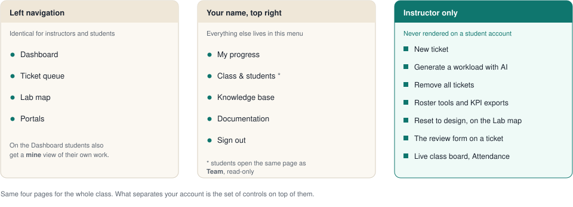
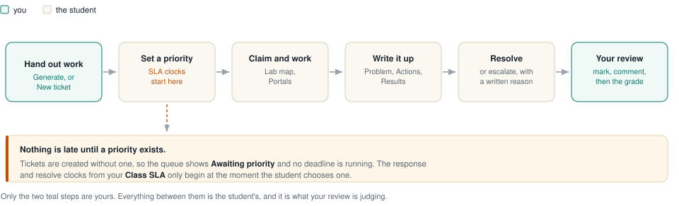
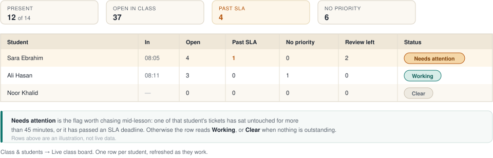
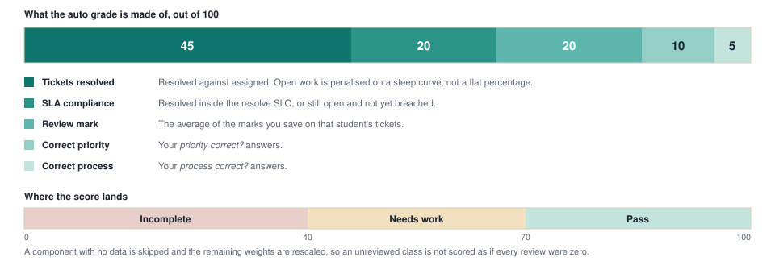

# Instructor guide

The full instructor manual for CCST Ticketing. Live URL: **https://ccst.website**

## Sign in

The sign-in screen has two tabs: **Sign in** and **Instructor signup**.

| Who | How |
| --- | --- |
| A new instructor with a new class | **Instructor signup** → **Signup code** (from the trainer), **Class name**, **Your full name**, username, password. That creates the class and an L3 account in one step |
| Students | You create them under **Class & students**. There is no student self-signup and no shared class password |

## What you see, and what students do not

Left navigation, same four entries for everyone:

| Page | What it is for |
| --- | --- |
| **Dashboard** | KPIs. Instructors see the whole queue; students also get **mine** |
| **Ticket queue** | Every ticket in the class, with filters, sorting and review state |
| **Lab map** | The classroom network. Students fix devices and cabling here |
| **Portals** | Simulated CBS, password, VAS and VPN portals |

Your name at the top right opens the rest:

| Menu entry | Notes |
| --- | --- |
| **My progress** | Your own grade view |
| **Class & students** | Roster and every class tool. Students see this as **Team**, read-only |
| **Knowledge base** | Articles students quote on tickets |
| **Documentation** | The guides that have a printable PDF |
| **Sign out** | Ends the session |

Instructor-only controls that never appear on a student account:

- **New ticket** on the ticket queue
- **Generate a workload with AI** and **Remove all tickets**
- Roster tools: add student, **Reset password**, **Remove**, **Timeline**, **KPI PDF**, **Export CSV**, **AI review**
- **Reset to design** on the Lab map
- The instructor review form on a ticket
- **Live class board** and **Attendance today**

## Before class — set the class up

Everything in this section lives on **Class & students**.

### Add students

The **Add a student** card takes three fields:

| Field | Notes |
| --- | --- |
| Full name | Shown on tickets and the roster |
| Username | `firstname.lastname`, lower case. Whatever you type is normalised, so `Sara Ebrahim` becomes `sara.ebrahim` |
| Password | At least 6 characters. Hand it to the student privately |

The new student appears in **Class roster** immediately and can sign in straight away.

Passwords are stored as a salted `scrypt` hash, so nobody — including you — can read one back. A forgotten password is reset, never recovered:

| Task | Where |
| --- | --- |
| Reset a password | Roster row → **Reset password** → type the new one (min 6 characters) |
| Remove a student | Roster row → **Remove** (asks for confirmation) |

### Class SLA

The **Class SLA** card is the clock every ticket is measured against. Edit the response minutes, resolve hours and the plain-language meaning per priority, then **Save SLA**.

| Priority | Response (minutes) | Resolve (hours) | Default meaning |
| --- | --- | --- | --- |
| Critical | 30 | 6 | Unreachable Cloud VM / cloud service |
| High | 60 | 12 | Billing/CBS ticket, or all PCs in a department |
| Medium | 120 | 24 | One PC issue, one PC with no internet, a shared printer, or a laptop off the wireless |
| Low | 180 | 48 | Password reset or minor request |

Response accepts 1–1440 minutes and resolve 1–168 hours, so out-of-range values are refused rather than silently clamped. Tickets are created **without** a priority: the deadlines only start once a student chooses one, and until then the queue shows **Awaiting priority**.

### Class announcement

**Class announcement** → type up to 280 characters → **Save note**. It shows as a banner on every page for the class, stamped with your name and the time. **Clear** removes it.

### Give the class work

Two ways, and you can mix them.

| Approach | How | When |
| --- | --- | --- |
| Generated workload | **Generate a workload with AI** → tick the kinds of call under **Choose the issues**, set how many of each per student → **Generate N tickets per student** | Normal class day; every student gets the same shape of workload |
| By hand | **Ticket queue** → **New ticket** | A specific scenario, a demo, or a one-off follow-up |

In the generator each row is one family of calls (password resets, cabling faults, hardware, device faults and so on). The note beside a row says whether it plants a **cable**, **hardware** or **device** fault in the lab, and the running total tells you tickets per student and tickets in all before you commit. Your chosen mix is remembered for the class.

Two things worth knowing:

- **Replace tickets generated earlier** wipes the previous generated batch instead of stacking a second one on top.
- The button is disabled until the class has at least one student.

> **Danger — Remove all tickets.** The red button in the same card empties the whole class queue. Comments and history go with the tickets and planted lab faults are undone. It asks once, and it cannot be undone. Only use it to reset a class between cohorts.

## During class

### What students are doing

1. Sign in with the account you created.
2. **Ticket queue** → filter **Assigned to me** → **Apply**.
3. Read the ticket and **set a priority** — that starts the SLA clocks.
4. **Claim ticket**, then work it on the **Lab map** or in **Portals**.
5. Write **Problem / Actions / Results** and **Save** often.
6. **Escalate** with a written reason, or **Resolve** once the fix is verified.

Their filters and sort order persist, so leaving the queue and coming back does not lose their view. Only **Reset filters** clears it.

### Your monitoring tools

| Tool | Where | What it tells you |
| --- | --- | --- |
| **Live class board** | Class & students | One row per student: **In**, **Open**, **Past SLA**, **No priority**, **Review left**, **Status**. Header totals show present, absent, class-wide open and past-SLA counts |
| **Attendance today** | Class & students | **Present** with sign-in times, and **Not seen**, for the current Bahrain day |
| **Timeline** | Roster row → **Timeline** | That student's activity: claims, hand-offs, escalations, map resets and portal actions |
| **Dashboard** | Left nav | Whole-queue backlog, average response, average resolve, CSAT and SLA compliance |

On the live board a student is flagged **Needs attention** when a ticket of theirs has sat untouched for more than 45 minutes or has passed an SLA deadline. Otherwise you get **Working** or **Clear**.

### Lab map controls

Students plug and unplug cables, open command prompts and IOS consoles, and use the **Hardware** bench on desk PCs. Cabling changes sync live to the whole class.

You also get **Reset to design**, next to **Find a device**:

- Restores the shipped cabling *and* every device configuration.
- Faults named by lab-map tickets that are **still open** are deliberately left in place — those cables stay unplugged and broken parts stay broken — so the work remains solvable.
- It confirms before running.

Live cursors show everyone currently on the map, labelled with their first name, and instructors are marked as such. If a student cannot see classmates, check they are in the same class and actually on the **Lab map** page.

### If the orange banner appears

A banner reading **"Nothing is being saved."** means the server fell back to in-memory storage. Tickets, priorities and cabling will revert. Stop the exercise and get the deployment's storage fixed before students do more work.

## Reviewing and marking

### Review a ticket

Open a ticket and use the instructor review form at the bottom:

| Control | Options |
| --- | --- |
| Was the priority correct? | Not judged · Yes — correct priority · No — wrong priority |
| Was the process correct? | Not judged · Yes — right steps · No — missed steps |
| Checklist | Impact assessed · Used the lab or portals as evidence · Escalated only when needed (or not at all) · Resolved/closed cleanly when fixed |
| Mark | The overall grade for the ticket |
| Comment | Required — this is the feedback the student reads |

Then **Save review**. The priority and process answers feed the grade directly, so "Not judged" leaves those components without data.

### AI review helpers

Available when the deployment has a classroom AI key configured. Without one the buttons fall back to written templates, so review by hand.

| Button | Scope |
| --- | --- |
| **AI review** on a ticket | Drafts that one review — it says *edit below if you disagree*, and you should |
| **AI review** on a roster row | Every ticket assigned to that student. Confirms first; can overwrite existing reviews |
| **AI-review class** on the roster header | Every unreviewed ticket in the class. Shift-click to overwrite existing reviews too |

Treat AI output as a first draft. Your saved edits replace it and are what the student sees.

### Exports

| Export | Where | Contents |
| --- | --- | --- |
| One student's KPI PDF | Roster row → **KPI PDF** | Score bars and cards: backlog, SLA, response/resolution, priority mix, assigned tickets, auto grade |
| Whole class, one PDF | Roster header → **Download all KPI PDFs** | The same report per student, combined |
| Marks sheet | Roster header → **Export CSV** | `fullName`, `username`, `email`, `tickets`, `backlog`, `resolved`, `slaCompliancePct`, `csat`, `reviewsGood`, `reviewsNeedsWork`, `reviewsIncomplete`, `priorityOkPct`, `processOkPct`, `gradeScore`, `gradeBand`, `lastSeenAt` |

Students can pull their own report from the Dashboard with **Download my KPI PDF**.

### How the auto grade is calculated

| Component | Weight | Source |
| --- | --- | --- |
| Tickets resolved | 45 | Resolved vs assigned — open work is penalised on a steep curve, not a flat percentage |
| SLA compliance | 20 | Resolved inside the resolve SLO, or still open and not yet breached |
| Overall review mark | 20 | Average of your per-ticket marks |
| Correct priority | 10 | Your *priority correct?* answers |
| Correct process | 5 | Your *process correct?* answers |

First-contact resolution is deliberately **not** part of the grade.

| Score | Band |
| --- | --- |
| 70–100 | **Pass** |
| 40–69 | **Needs work** |
| 0–39 | **Incomplete** |
| No usable data | **Insufficient data** |

Components with no data are skipped and the remaining weights are rescaled, so an unreviewed class is not scored as if every review were zero.

## After class

1. Take your marks offline while the data is fresh: **Export CSV**, plus **Download all KPI PDFs** if you want the visual reports.
2. Finish any outstanding reviews — unreviewed tickets leave the review component ungraded.
3. Reset individual passwords if anyone needs a fresh one; otherwise leave accounts as they are.
4. Decide what happens to the queue:

| Goal | Action |
| --- | --- |
| Continue next session | Leave the tickets in place |
| Fresh cabling, same tickets | **Lab map** → **Reset to design** |
| Clean slate for a new cohort | **Remove all tickets**, then generate a new workload |
| Remove last term's students | Roster row → **Remove**, one at a time |
